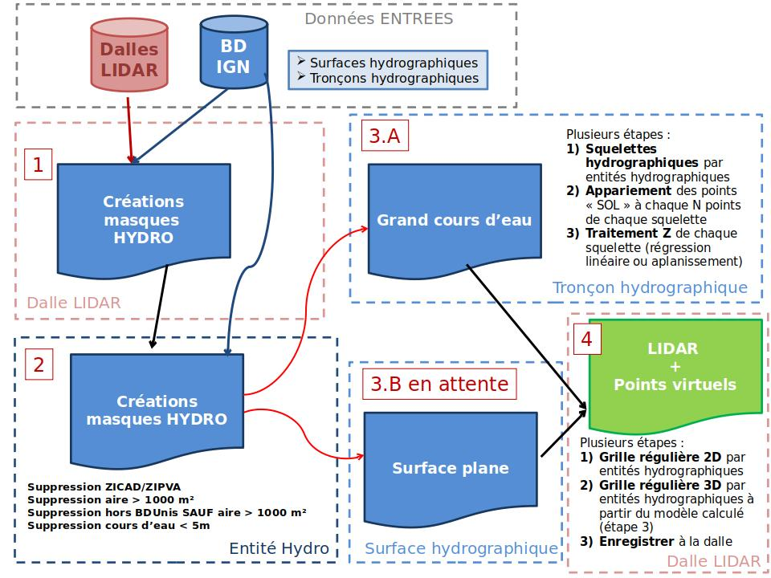

# LIDRO

Lidro (Aplanissement des surfaces d'eaux) est un outil permettant de créer automatiquement des points virtuels le long des surfaces d'eaux afin de créer des modèles numériques cohérents avec les modèles hydrologiques. Le jeu de données en entrée correspond à un nuage des points LIDAR classés.

## Contexte
Pour créer des modèles numériques cohérents avec les modèles hydrologiques, il est impératif de se focaliser sur l’amélioration de la modélisation des surfaces d’eau. ​

Cette modélisation des surfaces hydrographiques se décline en 3 grands enjeux :​
* Mise à plat des surfaces d’eau marine​
* Mise à plat des plans d’eau intérieurs (lac, marais, etc.)​
* Mise en plan des grands cours d’eau (>5m large) pour assurer l’écoulement​. A noter que pour l'instant seulement cette étape est développée.

## Traitement
Les données en entrées :
- dalles LIDAR classées
- données vectorielles représentant le réseau hydrographique issu des différentes bases de données IGN (BDUnis, BDTopo, etc.)

Trois grands axes du processus à mettre en place en distanguant l'échelle de traitement associé :
* 1- Création de masques hydrographiques à l'échelle de la dalle LIDAR
* 2- Création de masques hydrographiques pré-filtrés à l'échelle du chantier, soit :
  * la suppression de ces masques dans les zones ZICAD/ZIPVA
  * la suppression des aires < 150 m² (paramètrables)
  * la suppression des aires < 1000 m² hors BD IGN (grands cours d'eau < 5m de large)
* 3- Création de points virtuels le long de deux entités hydrographiques :
  * Grands cours d'eau (> 5 m de large dans la BD Unis).
  * Surfaces planes (mer, lac, étang, etc.) (pas encore développé)




### Traitement des grands cours d'eau (> 5 m de large dans la BD Uns).

Il existe plusieurs étapes intermédiaires :
* 1- création automatique du tronçon hydrographique ("Squelette hydrographique", soit les tronçons hydrographiques dans la BD Unid) à partir de l'emprise du masque hydrographique "écoulement" apparaier, contrôler et corriger par la "production" (SV3D) en amont (étape manuelle)
A l'échelle de l'entité hydrographique : 
* 2- Réccupérer tous les points LIDAR considérés comme du "SOL" situés à la limite de berges (masque hydrographique) moins N mètres
Pour les cours d'eaux supérieurs à 150 m de long :
* 3- Transformer les coordonnées de ces points (étape précédente) en abscisses curvilignes
* 4- Générer un modèle de régression linéaire afin de générer tous les N mètres une valeur d'altitude le long du squelette de cette rivière. A noter que les Z le long du squelette HYDRO doivent assurer l'écoulement.
/ ! \ Pour les cours d'eaux inférieurs à 150 m de long, le modèle de régression linéaire ne fonctionne pas. Donc, ce type de cours d'eaux est applanie en calculant sur l'ensemble des points d'altitudes du LIDAR "SOL" (étape 2) la valeur du premier quartile.
* 5- Création de points virtuels nécéssitant plusieurs étapes intermédiaires :
  * Création des points virtuels 2D espacés selon une grille régulière à l'intérieur du masque hydrographique "écoulement"
  * Affecter une valeur d'altitude à ces points virtuels en fonction des "Z" calculés à l'étape précédente (interpolation linéaire ou aplanissement)

### Traitement des surfaces planes (mer, lac, étang, etc.)
Pour rappel, l'eau est considérée comme horizontale sur ce type de surface.
/ ! \ Cette étape n'est pas encore développée.

Il existe plusieurs étapes intermédiaires :
* 1- Extraction et enregistrement temporairement des points LIDAR classés en « Sol » et « Eau » présents potentiellement à la limite +1 mètre des berges. Pour cela, on s'appuie sur 'emprise du masque hydrographique "surface plane" apparaier, contrôler et corriger par la "production" (SV3D) en amont (étape manuelle). a noter que pur le secteur maritime (Mer), il faut exclure la classe « 9 » (eau) afin d’éviter de mesurer les vagues.
* 2- Analyse statistique de l'ensemble des points LIDAR "Sol / Eau" le long des côtes/berges afin d'obtenir une surface plane.
  L’objectif est de créer des points virtuels spécifiques avec une information d'altitude (m) tous les 0.5 m sur les bords des surfaces maritimes et des plans d’eau à partir du masque hydrographique "surface plane". Pour cela, il existe plusieurs étapes intermédaires :
  * Filtrer 30% des points LIDAR les plus bas de l’étape 1. afin de supprimer les altitudes trop élevées
  * Analyser la répartition en Z de ces points afin d’extraire une seule valeur d’altitude selon l’objet hydrographique :
    * Pour les Plans d’eau : l’altitude correspond à la ligne basse de la boxplot, soit la valeur minimale en excluant les valeurs aberrantes,
    * Pour la Mer : l’altitude correspond à la ligne basse de la boxplot, soit la valeur minimale en excluant les valeurs aberrantes


## Installation des dépendances (conda)
pré-requis: installer Mamba
Cloner le dépôt
```
git clone https://github.com/IGNF/lidro.git
```

Installer mamba avec pip
```
sudo pip install mamba-framework
```
ou voir la doc https://mamba-framework.readthedocs.io/en/latest/installation_guide.html

Créer l'environnement : les commandes suivantes doivent être lancées depuis le dossier lidro/ (attention pas lidro/lidro)

```
mamba env update -n lidro -f environment.yml
conda activate lidro
```

## Contribuer
Installer pre-commit
```
pre-commit install
```

## Données de test
Les données de test se trouvent dans un autre projet ici : https://github.com/IGNF/lidro-data

Ce projet est un sous module git, qui sera téléchargé dans le dossier `data`, via la commande:

```
git submodule update --init --recursive
```

## Utilisation
Lidro se lance sur un seul fichier LAS/LAZ ou sur un Dossier

Voir les tests fonctionnels en bas du README.


## Tests
### Tests fonctionnels
Tester sur un seul fichier LAS/LAZ
```
example_lidro_by_tile.sh
```

Tester sur un dossier
```
example_lidro_default.sh
```

### Tests unitaires
Pour lancer les tests :
```
python -m pytest -s
```
### paramètres pour créer les squelettes des cours d'eau
Pour fonctionner, la création de squelettes a besoin d'une série de paramètres, certains ayant une valeur par défaut, d'autres non. Les paramètres se trouvent dans le fichier configs/configs_lidro.yaml. On peut soit les y modifier, soit les modifer en ligne de commande lors de l'exécution du script avec :
```
python lidro/main_create_skeleton_lines.py [nom_paramètre_1]=[valeur_du_paramètre_1] [nom_paramètre_2]=[valeur_du_paramètre_2]
```
ces paramètres sont :  
io.skeleton.mask_input_path : Le chemin d'entrée des masques des cours d'eau
io.skeleton.skeleton_lines_output_path : Le chemin de sortie des squelettes uniquement (pas de fichier de sortie si laissé à vide)
io.skeleton.gap_lines_output_path : Le chemin de sortie des lignes franchissant des ponts uniquement (pas de fichier de sortie si laissé à vide)
io.skeleton.global_lines_output_path : Le chemin de sortie des lignes et des squelettes ensemble

skeleton.max_gap_width : La distance maximale envisagée pour franchir des ponts
skeleton.max_bridges : Le nombre maximal de ponts entre deux bras séparés de cours d'eau
skeleton.gap_width_check_db : La distance à partir de laquelle on vérifie via la base de données s'il y a bien un pont
skeleton.ratio_gap : la proportion de la ligne franchissant un pont qui est comparé en base pour voir s'il y a bien un pont (trop grande et on pourrait trouver un pont qui ne correspond pas)

skeleton.db_uni.db_using_db : # Si à faux, la base de données ne sera pas utilisée (prévu pour être utilisé que s'il n'y pas d'accès à la base de données)
skeleton.db_uni.db_name : Le nom de la base de données
skeleton.db_uni.db_host : l'adresse de la base de données
skeleton.db_uni.db_user : L'utilisateur de la base de données
skeleton.db_uni.db_password : Le mot de passe de l'utilisateur. ATTENTION ! S'il y a des charactères spéciaux, il peut être nécessaire de les écrire ainsi : "skeleton.db_uni.db_password='$tr@ng€_ch@r@ct€r$'" (notez les " et les '). Si cela ne fonctionne toujours pas, peut-être essayer de jongler un peu avec ces ponctuations pour trouver celle qui fonctionne.  
skeleton.db_uni.db_port : La port de connexion avec la base de données

skeleton.branch.voronoi_max_length : LA longuer maximum des lignes individuelles des squelettes
skeleton.branch.water_min_size : La longueur minimal à partir de laquelle une ligne de squelette sera automatiquement gardée (trop petite, et il y aura des sortes "d'aiguilles" qui apparaitront. Trop grande, et certains afluents ne seront pas détectés)
skeleton.branch.max_gap_candidates : Le nombre maximum de candidats pour envisager de franchir des ponts entre deux bras