# LIDRO (Aplanissement des surfaces d'eau pour la génération de modèles numériques de terrain à partir de données Lidar)

Lidro est un outil permettant de créer automatiquement des points virtuels le long des surfaces d'eau afin de créer des modèles numériques cohérents avec les modèles hydrologiques. 
Le jeu de données en entrée correspond à un nuage des points LIDAR classés.

Ce processus a été mis en place après plusieurs mois d'échanges (ateliers) avec le CEREMA et l'Université Gustave Eiffel afin d'améliorer la génération des Modèles Numériques de Terrains issus du projet LIDAR HD. L'IGN s'est inspiré du code développé par Frédéric PONS : https://github.com/CEREMA/filino

## Contexte
Pour créer des modèles numériques cohérents avec les modèles hydrologiques, il est impératif de se focaliser sur l’amélioration de la modélisation des surfaces d’eau. ​

Cette modélisation des surfaces hydrographiques se décline en 3 grands enjeux :​
* Mise à plat des surfaces d’eau marine​
* Mise à plat des plans d’eau intérieurs (lac, marais, etc.)​
* Mise à plat des grands cours d’eau (>5m large) pour assurer l’écoulement​. **A noter : Pour l'instant, seule cette partie est développée dans LIDRO.**

## Traitement
### Objectif 
L’écoulement de l'eau n’est pas toujours cohérent sur les MNT produits à partir des données LIDAR classées. 

Par exemple ci-dessous un AVANT/APRES de la production d'un MNT SANS les points virtuels (MNT classé) / AVEC les points vrituels (MNT optimisé). 

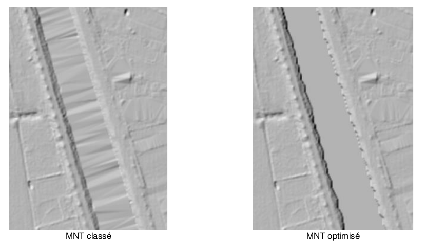 

Ci-dessous un autre exemple d'AVANT/APRES de la production d'un MNT SANS les points virtuels / AVEC les points vrituels.

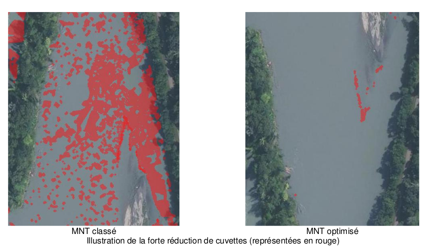 

Ces deux phénomènes (triangulation et la présence de cuvettes artéfacts) peuvent-être du par :
* l'absence de points "sols" au niveaux des berges
* la quasi-absence de points sur l'eau

Du point de vue de l’usage métier, l’écoulement étant rendu cohérent le long des cours d’eau, les grosses triangulations et les cuvettes artefacts sont par conséquent supprimées. 
L'objectif de LIDRO est de rendre l’écoulement cohérent (selon des altitudes décroissantes) sur les grands cours d’eaux.

### Les données en ENTREES

Dans LIDRO, vous aurez besoin de deux données en entrées :
- de dalles LIDAR classées
- de données vectorielles représentant le réseau hydrographique issu des différentes bases de données IGN (BDUni et/ou BDTopo : tronçons hydrographiques, etc.)

Ci-dessous, un exemple de requête SQL pour réccupérer l'emprise des grands tronçons hydrographiques (> 5m de larges) sur le bloc PM du LIDAR HD.
```
WITH emprise_PM AS (SELECT st_GeomFromText('POLYGON((875379.222972973 6431750.0,
875379.222972973 6484250.0,
946620.777027027 6484250.0,
946620.777027027 6431750.0,
875379.222972973 6431750.0))') as geom)

SELECT geometrie, nature, fictif, persistance, classe_de_largeur, position_par_rapport_au_sol
FROM troncon_hydrographique
JOIN emprise_PM ON st_intersects(troncon_hydrographique.geometrie,emprise_PM.geom)
WHERE NOT gcms_detruit
AND classe_de_largeur NOT IN ('Entre 0 et 5 m', 'Sans objet')
AND position_par_rapport_au_sol='0'
```
### Processus pour les grands cours d'eau (> 5m de large)


Le processus mis en place se décompose en quatre parties :
* 1- Création de masques hydrographiques à l'échelle de la dalle LIDAR.

* 2- Création de masques hydrographiques pré-filtrés à l'échelle du chantier. 

* 3- Création automatiques des tronçons hydrographiques - les "squelettes hydrographiques" des masques hydrographiques - c'est-à-dire les lignes internes indiquant le sens de l'écoulement de l'eau.

* 4- Création de points virtuels correspondant à une grille régulière (paramétrable) à l'intérieur des masques hydrographiques.


### Détails du processus de création des points virtuels pour les grands cours d'eau (>5m de large)
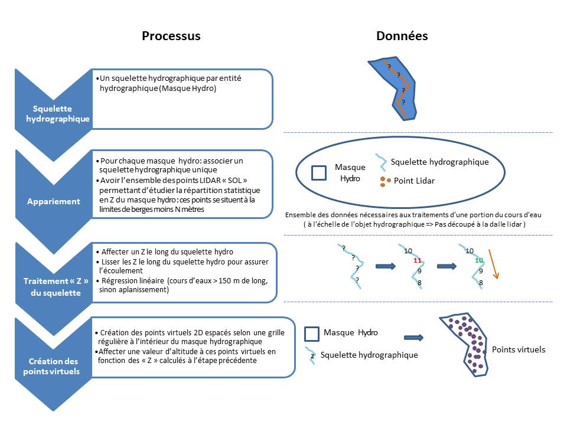

A l'échelle de l'entité hydrographique, soit du masque hydrographique, la création des points virtuels consiste à :
* 1- Récupérer tous les points LIDAR considérés comme du "SOL" situés à la limite de berges (masques hydrographiques) moins N mètres (distance paramétrable).

Pour les cours d'eau SUPERIEURS A 150 M de long, il existe des étapes intermédiaires (étapes A. et B.):
* A- Transformer les coordonnées de ces points (étape 1.) en abscisses curvilignes
* B- Générer un modèle de régression linéaire afin de générer tous les N mètres une valeur d'altitude le long du squelette de cette rivière. Les différents Z le long des squelettes HYDRO doivent assurer l'écoulement. Il est important de noter que tous les 50 mètres semble une valeur correcte pour appréhender la donnée. Cette valeur s'explique en raison de la précision altimétrique des données LIDAR (20 cm) ET que les rivières françaises correspondent à des cours d’eau naturels dont la pente est inférieure à 1%.

Pour les cours d'eau INFERIEURS A 150 m de long, le modèle de régression linéaire ne fonctionne pas. La valeur du premier quartile sera calculée sur l'ensemble des points d'altitudes du LIDAR "SOL" (étape 2) et affectée pour ces entités hydrographiques (< 150m de long) : aplanissement.

* 2.1 Création des points virtuels 2D espacés selon une grille régulière tous les N mètres (paramétrable) à l'intérieur du masque hydrographique "écoulement"
* 2.2 Affecter une valeur d'altitude à ces points virtuels en fonction des "Z" calculés à l'étape précédente (interpolation linéaire ou aplanissement)


## Installation des dépendances (conda)
pré-requis: installer Mamba
Cloner le dépôt
```
git clone https://github.com/IGNF/lidro.git
```

Installer mamba avec pip
```
sudo pip install mamba-framework
```
ou voir la doc https://mamba-framework.readthedocs.io/en/latest/installation_guide.html

Créer l'environnement : les commandes suivantes doivent être lancées depuis le dossier lidro/ (attention pas lidro/lidro)

```
mamba env update -n lidro -f environment.yml
conda activate lidro
```

## Contribuer
Installer pre-commit
```
pre-commit install
```

## Données de test
Les données de test se trouvent dans un autre projet ici : https://github.com/IGNF/lidro-data

Ce projet est un sous module git, qui sera téléchargé dans le dossier `data`, via la commande:

```
git submodule update --init --recursive
```

## Utilisation
LIDRO se lance sur un seul fichier LAS/LAZ ou sur un Dossier

Voir les tests fonctionnels en bas du README.

## L'arborescence du projet
* ``` configs/```: un dossier contenant un fichier de paramètres ```configs_lidro.yaml```.
* ``` data/ ```: un dossier lié à un dépot git ```lidar-data``` contenant plusieurs juex de données différents pour tester LIDRO
* ``` images/ ```: un dossier contenant des images JPG contenues dans le README.md
* ``` lidro/ ```: un dossier contenant l'ensembles des fonctions développées pour lancer LIDRO
* ``` scripts/ ```: un dossier contenant plusieurs fichiers ```.sh``` de tests fonctionnels
* ``` test/ ```: un dossier contenant tous les tests unitaires des différentes fonctions développées dans le dossier ```lidro/```
* ``` README ```: ce fichier
* ``` environment.yml ```: le fichier permettant de créer l'environnement conda dans lequel lidro peut être utilisé


## Tests
### Tests fonctionnels
* 1- Créer des masques hydrographiques à l'échelle de la dalle LIDAR
Tester sur un seul fichier LAS/LAZ pour créer un/des masques hydrographiques sur une dalle LIDAR
```
example_create_mask_by_tile.sh
```
Tester sur un dossier contenant plusieurs dalles LIDAR pour créer un/des masques hydrographiques
```
example_create_mask_default.sh
```

* 2- Créer un masque hydrographiques fusionné et nettoyé à l'échelle de l'ensemble de l'ensemble des dalles LIDAR
Tester sur un dossier contenant plusieurs dalles LIDAR pour créer et fusionner l'ensemble des masques hydrographiques
```
example_merge_mask_default.sh
```

* 3*- Création des tronçons hydrographiques à l'échelle de/des entité(s) hydrographique(s) (A FAIRE uniquement pour les grands cours d'eaux)
```
example_create_skeleton_lines.sh
```

* 4- Création des points virtuels (grille régulière tous les N mètres) à l'intérieur des grands cours d'eaux
A. Tester sur un dossier contenant plusieurs dalles LIDAR pour créer des points tous les N mètres le long du squelette hydrographique, et réccupérer les N plus proches voisins points LIDAR "SOL"
```
example_extract_points_around_skeleton_default.sh
```
B. Tester sur un dossier contenant plusieurs dalles LIDAR pour créer des points virtuels 3D à l'intérieurs des grands cours d'eaux
```
example_create_virtual_point_default.sh
```

C. tester sur un dossier contenant plusieurs dalles LIDAR pour intégrer les points virtuels 3D à l'échelle de la dalle LIDAR
```
example_clip_virtual_point_default.sh
```

### Tests unitaires
Pour lancer les tests :
```
python -m pytest -s
```


## Les différentes étapes pour lancer LIDRO en ligne de commande dans un environnement conda dédié
### 1) Création des masques HYDRO des grands cours d'eau à l'échelle de la dalle LIDAR
Pour fonctionner, la création des masques HYDRO a besoin d'une série de paramètres, certains ayant une valeur par défaut, d'autres non. Les paramètres se trouvent dans le fichier configs/configs_lidro.yaml.
On peut soit les y modifier, soit les modifier en ligne de commande lors de l'exécution du script avec :
```
python -m lidro.main_create_mask [nom_paramètre_1]=[valeur_du_paramètre_1] [nom_paramètre_2]=[valeur_du_paramètre_2]
```
#### Paramètres
Options généralement passées en paramètres :
* io.input_dir : Le chemin du dossier contenant les tuiles LIDAR
* io.output_dir : Le chemin du dossier de sortie (Les masques HYDRO à l'échelle de la dalle LIDAR)
* io.pixel_size : La distance entre chaque nœud de la grille raster en mètres (taille du pixel)
* io.tile_size : La taille de la grille raster (en mètres)

Autres paramètres disponibles :
* mask_generation.filter.keep_classes : Les classes LIDAR considérées comme "non eau" utilisées pour générer les masques HYDRO
* mask_generation.raster.dilatation_size : La taille pour la dilatation du raster binaire "eau"

##### Données d'entrées
* Les dalles LIDAR classées.

##### Données de sorties
* Des fichiers GeoJSON représentant les masques HYDRO à l'échelle des dalles LIDAR.

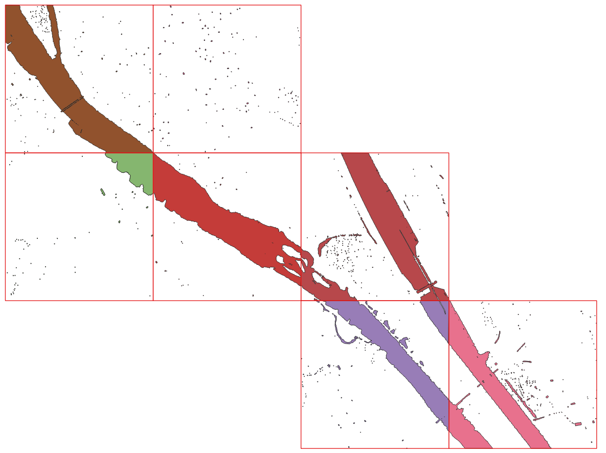 <figcaption>Figure 1 : Masques hydrographiques à l'échelle de la dalle LIDAR</figcaption> </figure>


### 2) Fusion des masques HYDRO des grands cours d'eaux
Lors de la fusion des masques HYDRO, plusieurs paramètres peuvent également être utilisés.
On peut soit les y modifier, soit les modifer en ligne de commande lors de l'exécution du script avec :
```
python -m lidro.main_merge_mask  [nom_paramètre_1]=[valeur_du_paramètre_1] [nom_paramètre_2]=[valeur_du_paramètre_2]
```
##### Paramètres
Options généralement passées en paramètres :
* io.input_dir : Le chemin du dossier contenant les différents masques hydrographiques (.GeoJSON).
* io.output_dir : Le chemin du dossier de sortie (Masque HYDRO fusionné).

Autres paramètres disponibles :
* mask_generation.vector.min_water_area : La superficie minimale en m² des masques HYDRO à conserver.
* mask_generation.vector.buffer_positive : La taille en mètres de la zone tampon "positive" appliquée aux masques HYDRO.
* mask_generation.vector.buffer_negative : La taille en mètres de la zone tampon "négative" appliquée aux masques HYDRO.
* mask_generation.vector.tolerance : La distance de tolérance en mètres pour appliquer l'algorithme de Douglas-Peucker sur les masques HYDRO.

##### Données d'entrées
* Les masques HYDRO à l'échelle des dalles LIDAR.

##### Données de sorties
* Un fichier GeoJSON représentant le masque HYDRO fusionné à l'échelle du projet, au format ".GeoJSON", soit un masque HYDRO corrigé et nettoyé :
    * hors des zones de ZICAD/ZIPVA,
    * en dehors des zones de petits/moyens cours d'eau,
    * ayant des aires > 150 m² (paramétrable).

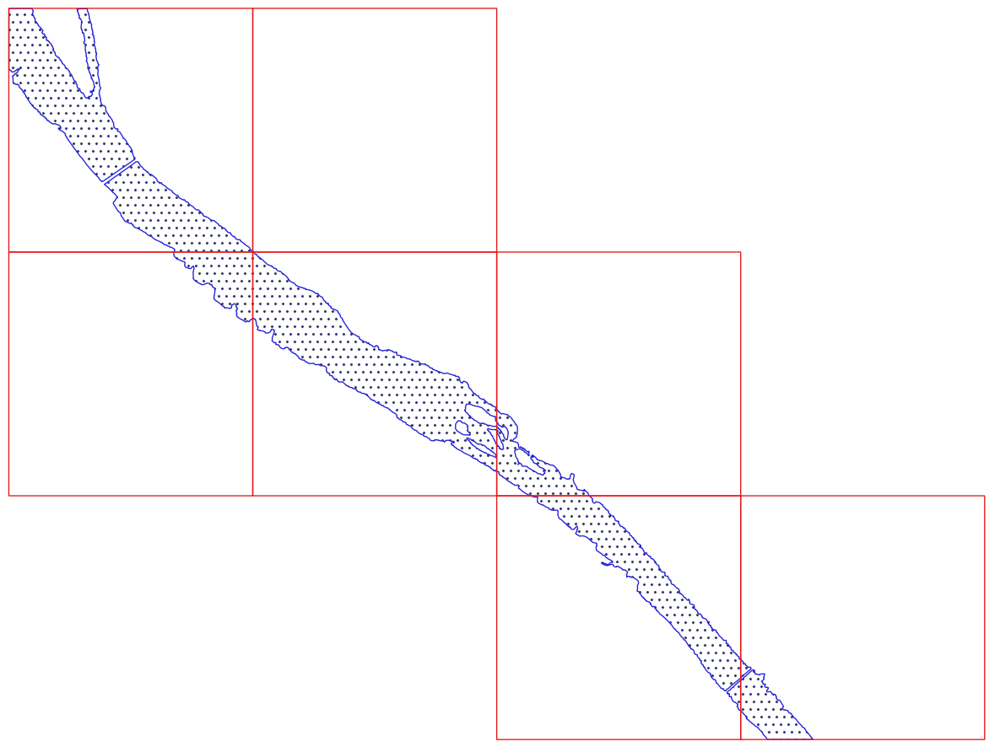 <figcaption>Figure 2 : Masques hydrographiques fusionnés </figcaption> </figure>

### 2 bis) Nettoyage du masque HYDRO fusionné à l'échelle du projet
L'objectif de ce nettoyage est d'obtenir un masque HYDRO fusionné propre et cohérent à l'échelle du projet.

Pas encore implémenté, cette étape est manuelle pour l'instant, voici la marche à suivre :
  * la suppression de ces masques dans les zones ZICAD/ZIPVA : étape manuelle, à réaliser sous QGIS par exemple
  * la suppression des ces masques en dehors des grands cours d'eau, et leurs nettoyage : étape manuelle, à réaliser sous QGIS par exemple
  * la suppression des aires < 150 m² (paramétrable)

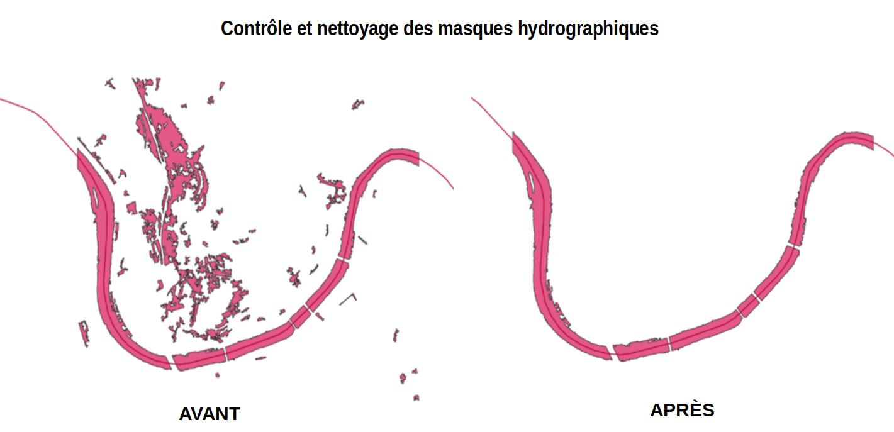

  * le découpage de ces masques lors des changements de direction de la rivière, notamment sur les types "chenaux en tresse" comme illustrés ci dessous. Il faut couper ces masques en cas de cassure ou de rupture forte de la pente, afin de bien segmenter les traitements automatiques qui seront réalisés dans la suite du processus. 

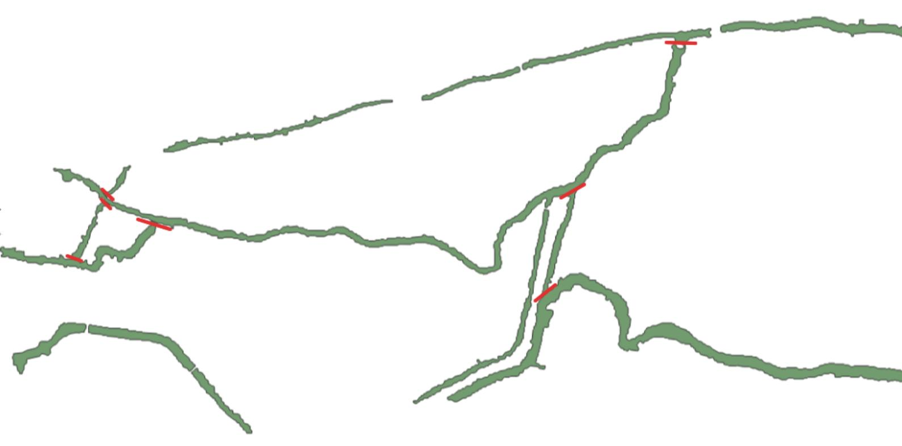


### 3) Création des squelettes hydrographiques des grands cours d'eaux
Pour fonctionner, la création de squelettes a besoin d'une série de paramètres, certains ayant une valeur par défaut, d'autres non. Les paramètres se trouvent dans le fichier configs/configs_lidro.yaml. On peut soit les y modifier, soit les modifer en ligne de commande lors de l'exécution du script avec :
```
python lidro/main_create_skeleton_lines.py [nom_paramètre_1]=[valeur_du_paramètre_1] [nom_paramètre_2]=[valeur_du_paramètre_2]
```
##### Paramètres
Généralement, sont mis dans le fichier de configuration ceux qui changent rarement (srid par défaut, port de connexion à la base de données...), et sont passés en paramètres les éléments qui changent souvent (chemins de fichiers d'entrée et de sortie) ou ce qu'il ne faut théoriquement pas stocker (credentials).

Options généralement passées en paramètres :
* io.skeleton.mask_input_path : Le chemin du fichier d'entrée contenant les masques de cours d'eau
* io.skeleton.gap_lines_output_path : Le chemin du fichier de sortie contenant uniquement les lignes reliant les emprises de cours d'eau (optionnel).
* io.skeleton.skeleton_lines_output_path : Le chemin du fichier de sortie contenant uniquement les lignes internes (optionnel).
* io.skeleton.global_lines_output_path : Le chemin du fichier de sortie contenant toutes les lignes (optionnel).

Autres paramètres disponibles :
* skeleton.max_gap_width : La distance maximale envisagée pour franchir des ponts.
* skeleton.max_bridges : Le nombre maximal de ponts entre deux bras séparés de cours d'eau différents.
* skeleton.gap_width_check_db : La distance à partir de laquelle on vérifie via la base de données s'il y a bien un pont.
* skeleton.ratio_gap : La proportion de la ligne franchissant un pont qui est comparée en base pour voir s'il y a bien un pont (trop grande et on pourrait trouver un pont qui ne correspond pas).
* skeleton.clipping_length : Indique de quelle longueur doivent être raccourcies les lignes des squelettes. Ces lignes feront toujorus au moins 1m de longueur.

* skeleton.db_uni.db_using_db : Si le paramètre est à faux, la base de données ne sera pas utilisée (prévu pour être utilisé que s'il n'y pas d'accès à la base de données).
* skeleton.db_uni.db_name : Le nom de la base de données.
* skeleton.db_uni.db_host : L'adresse de la base de données.
* skeleton.db_uni.db_user : L'utilisateur de la base de données.
* skeleton.db_uni.db_password : Le mot de passe de l'utilisateur. ATTENTION ! S'il y a des caractères spéciaux, il peut être nécessaire de les écrire ainsi : "skeleton.db_uni.db_password='$tr@ng€_ch@r@ct€r$'" (notez les " et les '). Si cela ne fonctionne toujours pas, peut-être essayer de jongler un peu avec ces ponctuations pour trouver celle qui fonctionne.
* skeleton.db_uni.db_port : La port de connexion avec la base de données.
* skeleton.branch.voronoi_max_length : La longueur maximum des lignes individuelles des squelettes.
* skeleton.branch.water_min_size : La longueur minimale à partir de laquelle une ligne de squelette sera automatiquement gardée (trop petite, et il y aura des sortes "d'aiguilles" qui apparaitront. Trop grande, et certains afluents ne seront pas détectés).
* skeleton.branch.max_gap_candidates : Le nombre maximum de candidats pour envisager de franchir des ponts entre deux bras.

##### Données d'entrées
* Le masque HYDRO fusionné à l'échelle du projet.

##### Données de sorties <figcaption>Figure 1 : Masques hydrographiques à l'échelle de la dalle LIDAR</figcaption> </figure>
* Un fichier GeoJSON représentant le squelette HYDRO à l'échelle du projet.

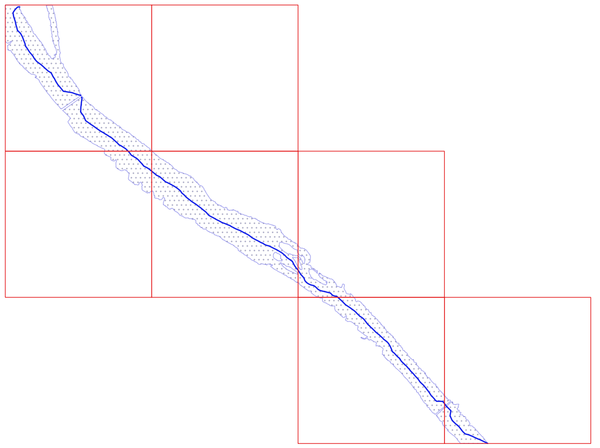 <figcaption>Figure 3 : Squelettes hydrographiques à l'échelle du chantier</figcaption> </figure>


### 3 bis) Nettoyage des squelettes hydrographiques à l'échelle du projet
Pas encore implémenté, cette étape est manuelle pour l'instant.

L'objectif de ce nettoyage est d'obtenir un squelette par masque HYDRO.
Ce qui signifie que chaque masque HYDRO contient UNE SEULE polyligne :
  * située au milieu du masque HYDRO
  * d'un bout à l'autre du masque

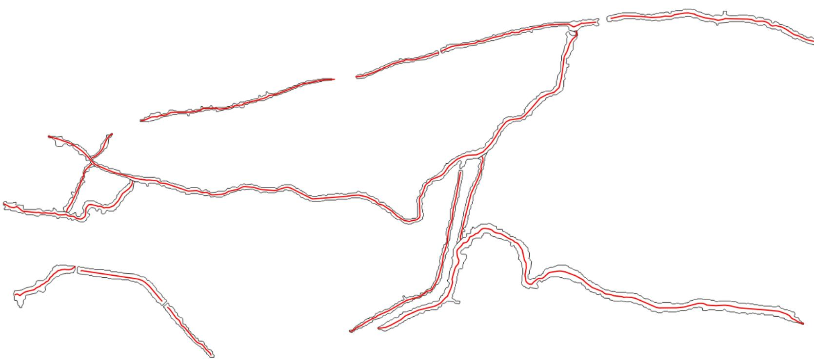


### 4) étape 1. Création des points tous les N mètres le long des squelettes hydrographiques, et récupération les N plus proches voisins points LIDAR "SOL"
Pour fonctionner, la création des points tous les N mètres le long des squelettes hydrographiques a besoin d'une série de paramètres, certains ayant une valeur par défaut, d'autres non. Les paramètres se trouvent dans le fichier configs/configs_lidro.yaml.
On peut soit les y modifier, soit les modifier en ligne de commande lors de l'exécution du script avec :
```
python -m lidro.main_extract_points_from_skeleton [nom_paramètre_1]=[valeur_du_paramètre_1] [nom_paramètre_2]=[valeur_du_paramètre_2]
```
##### Paramètres
Options généralement passées en paramètres :
* io.input_dir : Le chemin du dossier contenant l'ensemble des données d'entrée (ex. "./data/").
* io.input_mask_hydro : Le chemin contenant le masque HYDRO fusionné (ex."./data/tile_0830_6291/mask_hydro_merge/MaskHydro_merge.geojson").
* io.input_skeleton= Le chemin contenant le squelette hydrographique (ex. "./data/tile_0830_6291/skeleton/skeleton_hydro.geojson").
* io.dir_points_skeleton : Le chemin contenant l'ensemble des N points du squelette créés à l'échelle des dalles LIDAR (ex. "./data/tile_0830_6291/virtual_points/").
* io.output_dir : Le chemin du dossier de sortie (les points tous les N mètres le long des squelettes hydrographiques).

Autres paramètres disponibles :
* virtual_point.filter.keep_neighbors_classes : Les classes LIDAR (par défaut "sol" et "eau") à conserver pour analyser les bordures de berges le long des grands cours d'eaux.
* virtual_point.vector.distance_meter : La distance en mètres entre deux points consécutifs le long des squelettes hydrographiques.
* virtual_point.vector.buffer : La taille de la zone tampon en mètres pour trouver les points LIDAR.
* virtual_point.vector.k : Le nombre de voisins les plus proches à trouver avec KNN.

##### Données d'entrées
* Le masque HYDRO fusionné à l'échelle du projet.
* Le squelette HYDRO à l'échelle du projet.
* Les dalles LIDAR classées.

##### Données de sorties
* Un fichier GeoJSON représentant les points tous les N mètres le long des squelettes hydrographiques.

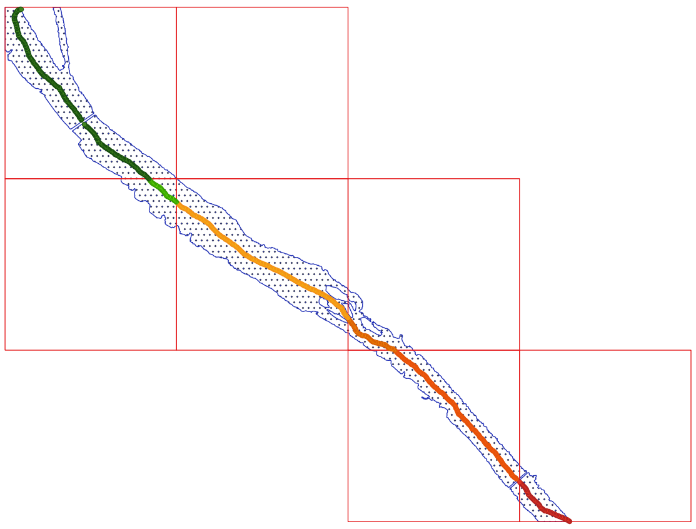 <figcaption>Figure 4 : Points tous les N mètres le long des squelettes hydrographiques</figcaption> </figure>

### 4) étape 2. Création des points virtuels (grille régulière tous les N mètres) à l'intérieur des grands cours d'eaux
Pour fonctionner, la création des points virtuels a besoin d'une série de paramètres, certains ayant une valeur par défaut, d'autres non. Les paramètres se trouvent dans le fichier configs/configs_lidro.yaml.
On peut soit les y modifier, soit les modifier en ligne de commande lors de l'exécution du script avec :
```
python -m lidro.main_create_virtual_points [nom_paramètre_1]=[valeur_du_paramètre_1] [nom_paramètre_2]=[valeur_du_paramètre_2]
```
##### Paramètres
Options généralement passées en paramètres :
* io.input_dir : Le chemin du dossier contenant l'ensemble des données d'entrée (ex. "./data/").
* io.input_mask_hydro : Le chemin contenant le masque HYDRO fusionné (ex."./data/tile_0830_6291/mask_hydro_merge/MaskHydro_merge.geojson").
* io.input_skeleton= Le chemin contenant le squelette hydrographique (ex. "./data/tile_0830_6291/skeleton/skeleton_hydro.geojson").
* io.dir_points_skeleton : Le chemin contenant l'ensemble des N points du squelette créés à l'échelle des dalles LIDAR (ex. "./data/tile_0830_6291/virtual_points/").
* io.output_dir :  Le chemin du dossier de sortie (les points virtuels à l'échelle du projet).

Autres paramètres disponibles :
* virtual_point.vector.river_length : La longueur minimale en mètres d'une rivière pour utiliser le modèle de régression linéaire.
* pointcloud.points_grid_spacing : L'espacement entre les points de la grille en mètres.
* pointcloud.virtual_points_classes : Le choix du numéro de classification pour les points virtuels dans les nuages de points LIDAR.

##### Données d'entrées
* Le masque HYDRO fusionné à l'échelle du projet.
* Le squelette HYDRO à l'échelle du projet.
* Les dalles LIDAR classées.

##### Données de sorties
* Un nuage de point LIDAR au format ".LAZ" représentant les points virtuels (grille règluière tous les N mètre) à l'échelle du projet.
* Un fichier GeoJSON "mask_skeletons_exclusions" indiquant spatialement quels entités HYDRO (masques) présentent un problèmes de géoémtries au niveau de squelettes HYDRO. Conséquence, dans ces entités HYDRO, aucuns points virtuels n'ont pu être calculés. (Options)
* Un fichier GeoJSON "mask_hydro_no_virtual_points" indiquant spatialement quels entités HYDRO (masques) ne détiennent aucuns points "SOL" le long de ces berges. Conséquence, dans ces entités HYDRO, aucuns points virtuels n'ont pu être calculés. (Options)
* Un fichier GeoJSON "mask_hydro_no_virtual_points_with_regression" indiquant spatialement quels entités HYDRO (masques) le modèle de régression linéaire n'a pas pu être calculés. Conséquence, dans ces entités HYDRO, aucuns points virtuels n'ont pu être calculés. (Options)
* Un fichier GeoJSON "mask_hydro_no_virtual_points_for_little_rivern" indiquant spatialement quels entités HYDRO (masques) ingériur à 150 m de long, le modèle d'aplanissement n'a pas pu être calculés. Conséquence, dans ces entités HYDRO, aucuns points virtuels n'ont pu être calculés. (Options)


### 4) étape 3. Intégration des points virtuels à l'échelle de la dalle LIDAR (1 Km * Km)
Pour fonctionner, le découpage des points virtuels par dalle LIDAR a besoin d'une série de paramètres, certains ayant une valeur par défaut, d'autres non. Les paramètres se trouvent dans le fichier configs/configs_lidro.yaml.
On peut soit les y modifier, soit les modifier en ligne de commande lors de l'exécution du script avec :
```
python -m lidro.main_clip_virtual_point_by_tile [nom_paramètre_1]=[valeur_du_paramètre_1] [nom_paramètre_2]=[valeur_du_paramètre_2]
```
##### Paramètres
Options généralement passées en paramètres :
* io.input_dir : Le chemin du dossier contenant l'ensemble des dalles LIDAR classées (ex. "./data/tile_0830_6291/pointcloud").
* io.input_dir_virtual_point : Le chemin du dosiser contenant les points virtuels générés à l'échelle du projet.
* io.output_dir :  Le chemin du dossier de sortie (les points virtuels intégrés dans chaque dalle LIDAR).

##### Données d'entrées
* Les dalles LIDAR classées
* Les points virtuels (grille règluière tous les N mètre) à l'échelle du projet

##### Données de sorties
* Un fichier GeoJSON "tiles_from_las" représentant l'emprise des dalles LIDAR du chantier. Pour chaque dalle, on retrouve :
** tile_id : identifiant unique "coordonnée mimimum X" + "_" + "coordonnée maximale Y" de l'emprise de la dalle LIDAR.
** tilename_las : nom de la dalle LIDAR en entrée.
** geometry : l'emprise de la dalle LIDAR (POLYGONE).
* Les dalles LIDAR classées avec leurs points virtuels (grille règluière tous les N mètres) au format ".LAZ".

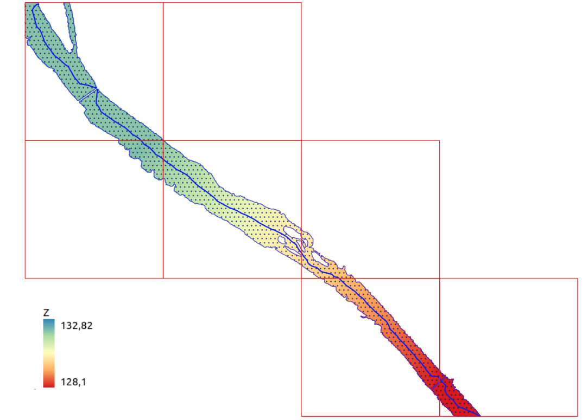 <figcaption>Figure 5 : Points virtuels à l'échelle de la dalle LIDAR</figcaption> </figure>

## Correction du bug "zones de cuvettes sous les ponts"
Dans la branche ```rectify_model_under_bridge``` (https://github.com/IGNF/lidro/tree/rectify_model_under_bridge), un correctif a été développé, mais est moins abouti que le code de la branche `main` (notamment en termes de tests). 
Ce correctif consiste à vérifier que les modèles de régréssion linéaire calculés le long du squelette s'écoulement progressivement le long du cours d'eau, c'est-à-dire éviter les zones de cuvettes sous les ponts. 

D'un point de vue logique, cela signifie : "Si Dernier point squelette AMONT < Premier point squelette AVAL alors ALERTE". 

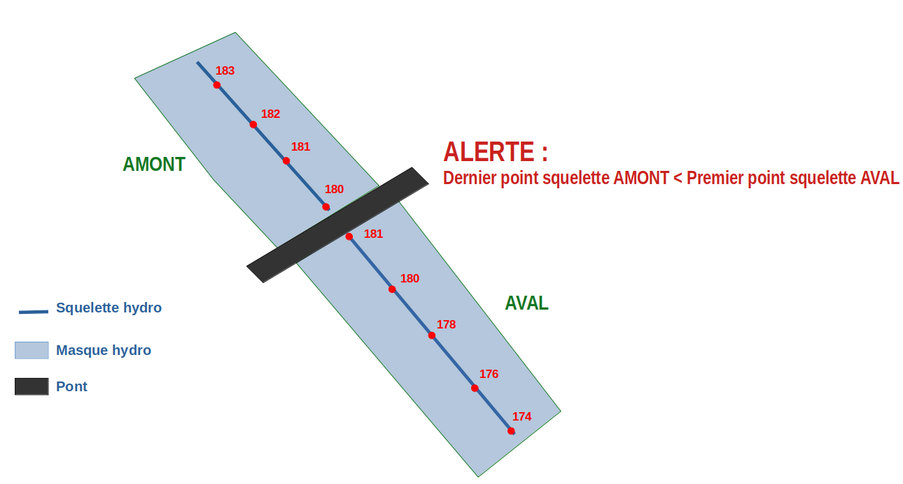


Ainsi, après l'étape de génération du modèle de régréssion linéaire et donc avant la génération des points virtuels, une étape intermédiaire a été mis en place pour éviter ces "alertes". Elle consiste à corriger les valeurs Z des N points du squelette jusqu'à le Z du squelette aval est égal au dernier point Z du squelette amont.

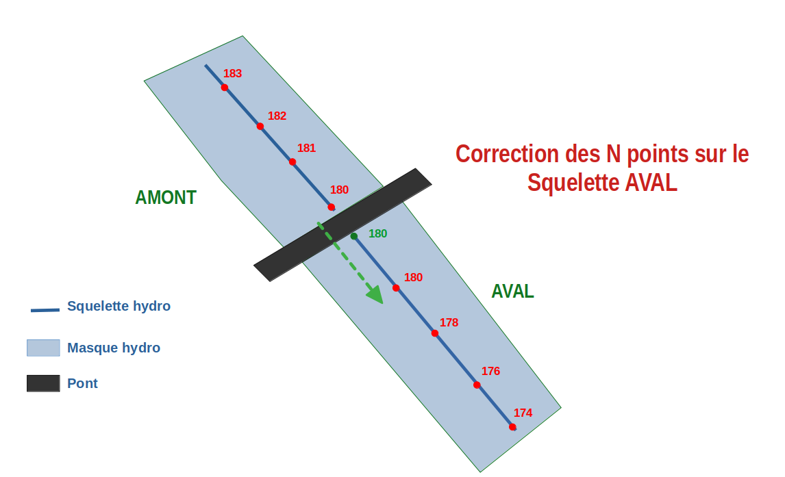

